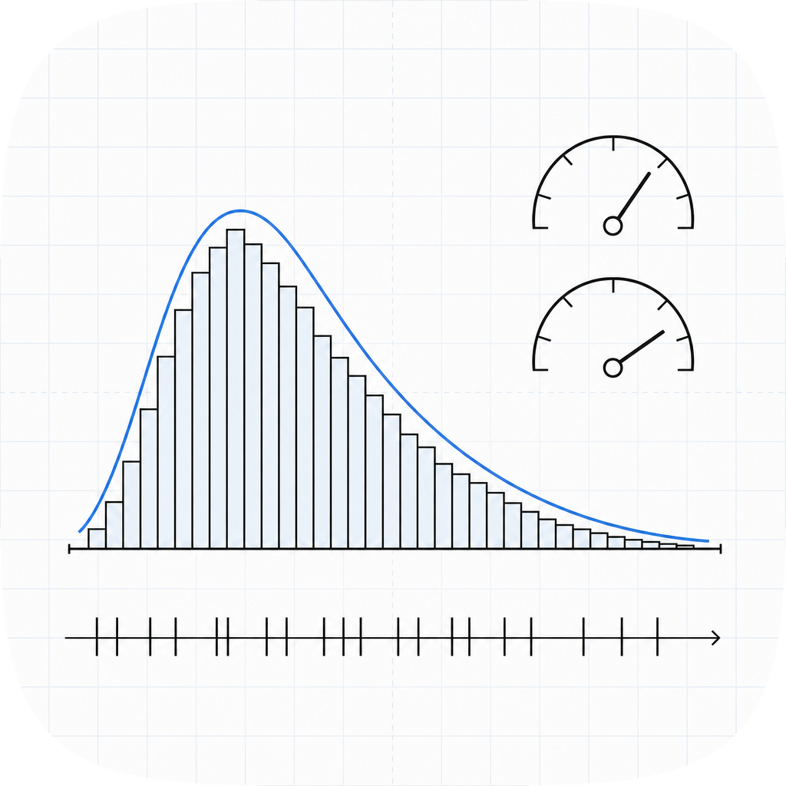

# spikestats

<p align="center">
  
</p>

Spike-train statistics in pure Python, with zero dependencies.

`spikestats` computes the standard measures of spike-train rate and variability from a plain
list of spike times: firing rate, inter-spike intervals, coefficient of variation, CV2,
local variation (Lv and the refractory-corrected LvR), spike counts, and the Fano factor.
There is nothing to configure and nothing to install beyond the package itself: the input
is a `list[float]` of spike times and the output is a `float`.

It pairs with [spikegen](https://github.com/amaar-mc/spikegen) for generating trains and
[spikedist](https://github.com/amaar-mc/spikedist) for comparing them. The three share the
same plain-list data model, so they compose without adapters.

## Why

The established tools for these measures, Elephant and spiketools, are excellent but pull in
NumPy, SciPy, and custom data objects (`neo.SpikeTrain` and friends). When you only need a
firing rate or a CV from a list of spike times, that is a heavy dependency tree to carry, and
it is awkward in teaching material, small scripts, and lightweight pipelines. `spikestats`
keeps the math, drops the dependencies, and works on the lists you already have.

## Install

```sh
pip install spikestats
```

## Usage

```python
import spikestats as ss

spikes = [0.012, 0.031, 0.058, 0.090, 0.110, 0.155]  # seconds

ss.firing_rate(spikes, duration=0.2)   # spikes per second
ss.inter_spike_intervals(spikes)       # consecutive differences
ss.cv_isi(spikes)                      # coefficient of variation of the ISIs
ss.cv2(spikes)                         # Holt et al. 1996, robust to rate drift
ss.lv(spikes)                          # Shinomoto et al. 2003 local variation
ss.lvr(spikes, refractory=0.002)       # Shinomoto et al. 2009, refractory-corrected
ss.spike_counts(spikes, duration=0.2, bin_width=0.05)
ss.fano_factor(spikes, duration=0.2, bin_width=0.05)
```

### Time-resolved metrics

```python
import spikestats as ss

spikes = [0.012, 0.031, 0.058, 0.090, 0.110, 0.155, 0.210, 0.245]  # seconds

# Non-overlapping bin counts tiling [0, duration)
counts = ss.binned_spike_counts(spikes, duration=0.3, bin_width=0.1)
# => [3, 3, 2]  (one list[int] per bin)

# Sliding-window firing rate: returns (center_times, rates_hz)
centers, rates = ss.time_resolved_rate(spikes, duration=0.3, bin_width=0.1, step=0.05)

# PSTH averaged over multiple trials: returns (bin_center_times, mean_rate_hz)
trials = [spikes, [0.020, 0.060, 0.100, 0.140, 0.200]]
bin_centers, mean_rates = ss.psth(trials, duration=0.3, bin_width=0.1)

# Per-bin Fano factor across trials: returns (bin_center_times, fano_per_bin)
bin_centers, fano = ss.time_resolved_fano(trials, duration=0.3, bin_width=0.1)
```

## API

All functions take spike times as a sequence of numbers and sort them internally.

### Scalar metrics

- `firing_rate(spikes, *, duration)`: spike count divided by `duration`.
- `inter_spike_intervals(spikes)`: list of consecutive differences (empty for fewer than two spikes).
- `cv_isi(spikes)`: population standard deviation of the ISIs over their mean. Regular train 0, Poisson 1.
- `cv2(spikes)`: mean of `2 * |I(n+1) - I(n)| / (I(n+1) + I(n))` over adjacent intervals.
- `lv(spikes)`: mean of `3 * ((I(n) - I(n+1)) / (I(n) + I(n+1)))^2`. Regular train 0, Poisson 1.
- `lvr(spikes, *, refractory)`: LvR with a refractoriness constant in the spike-time unit.
- `spike_counts(spikes, *, duration, bin_width)`: counts per equal-width bin tiling `[0, n * bin_width)`.
- `fano_factor(spikes, *, duration, bin_width)`: population variance of the bin counts over their mean.

### Time-resolved metrics

All functions use the half-open boundary `[0, duration)`: a spike at exactly `duration` is excluded.

- `binned_spike_counts(spikes, *, duration, bin_width) -> list[int]`: spike counts in
  `int(duration / bin_width)` consecutive non-overlapping bins tiling `[0, duration)`.
- `time_resolved_rate(spikes, *, duration, bin_width, step) -> tuple[list[float], list[float]]`:
  sliding-window firing rate. Window of width `bin_width` steps by `step` across `[0, duration)`.
  Returns `(window_center_times, rates_in_hz)`. Window positions are computed by integer indexing
  of the step size to avoid floating-point drift.
- `psth(trials, *, duration, bin_width) -> tuple[list[float], list[float]]`: peristimulus time
  histogram. `trials` is a sequence of spike-time sequences. Returns `(bin_center_times,
  mean_rate_per_bin_hz)` averaged over trials. Raises `ValueError` on empty `trials`.
- `time_resolved_fano(trials, *, duration, bin_width) -> tuple[list[float], list[float]]`:
  per-bin Fano factor (population variance / mean of per-trial counts). Returns
  `(bin_center_times, fano_per_bin)`. Bins with zero mean across all trials are returned as
  `float('nan')`. Uses population variance (denominator N), so a single trial always gives 0.

Parameters after `*` are keyword-only and have no default values; pass them explicitly.

## Notes

- `cv_isi` uses the population standard deviation, matching the common `numpy.std` default.
- `cv2`, `lv`, and `lvr` need at least three spikes; they raise a clear `ValueError` otherwise.
- `spike_counts` uses `floor(duration / bin_width)` equal-width bins, so every bin has the same
  width; any remainder of the duration and any spikes outside the binned window are ignored.
- `binned_spike_counts` uses `int(duration / bin_width)` bins (same count). All time-resolved
  functions use the half-open interval `[0, duration)`: a spike at `t == duration` is excluded.
- `time_resolved_fano` uses population variance (denominator N). With a single trial, variance
  is 0 for every bin; use multiple trials to get meaningful Fano estimates. Bins where the
  mean count is 0 across all trials are returned as `float('nan')`.

## License

MIT
